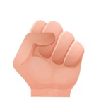
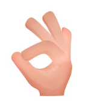
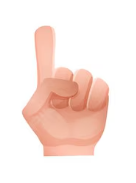
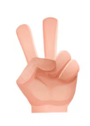
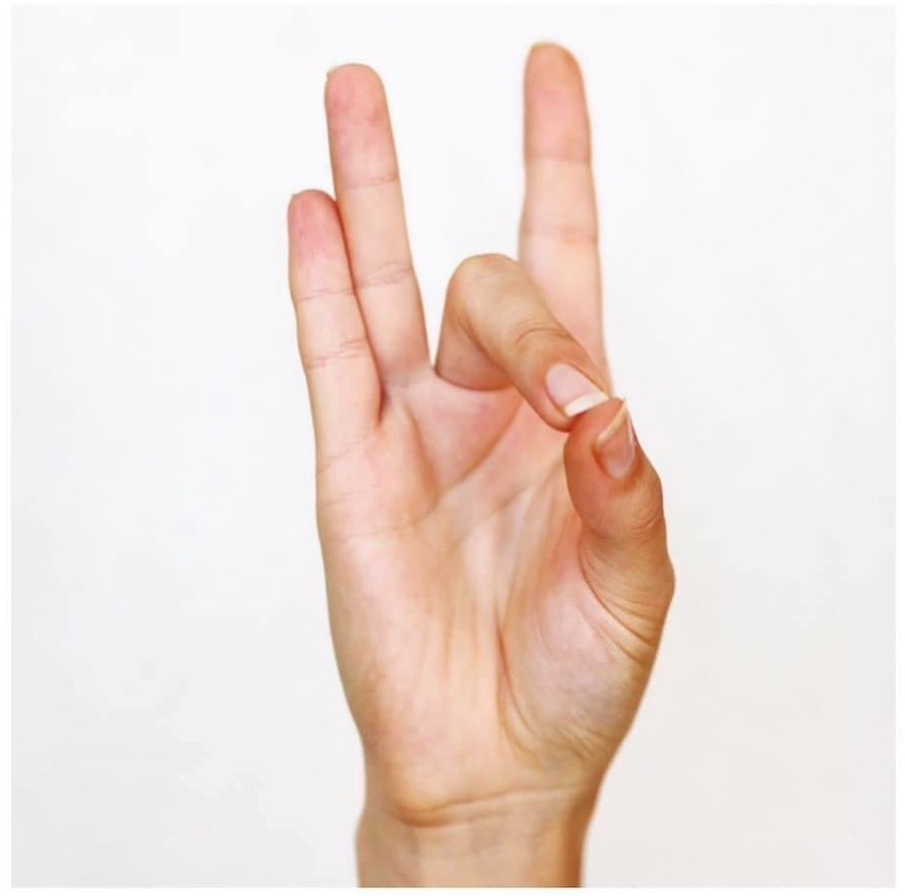
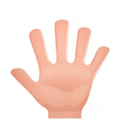

# Hand Gesture Control HGC

### What is Hand Gesture Window Control ?

Hand Gesture Window Control is a <mark>computer vision–based desktop control system</mark> written in Python that allows users to control windows, mouse movement, scrolling, and system shortcuts using hand gestures captured via webcam. The software leverages MediaPipe Hands for real-time hand landmark detection and OpenCV for video processing, translating specific finger positions and distances into OS-level actions such as ALT+TAB, window dragging, mouse movement, clicks, and scrolling; all without touching the keyboard or mouse.

---

# 🤸 Quickstart

To get started with **HGC**, follow these steps:

### 1️⃣ Install dependencies

- Make sure you have Python installed ( tested with Python ≥ 3.12 ), then install the required libraries:

`pip install opencv-python mediapipe pyautogui pywin32`

### 2️⃣ Run the application

Simply execute the script:

`python Hand-Gesture-Control.py`

- Make sure:
1. Your webcam is connected
2. You are running the script on Windows
3. The webcam has a clear view of your right hand

### 3️⃣ Exit the program

***Press Q*** on your keyboard to close the application safely.

---

# ⚙️ How it works?

The system continuously captures frames from the webcam and processes them using MediaPipe Hands, extracting 21 hand landmarks. Finger states and distances between key landmarks are used to drive a state machine that switches between interaction modes. Only the right hand is processed to avoid ambiguity.

## ✋ Hand Gestures & Modes

Below is a description of each supported gesture and how your hand should be positioned.

### 💤 Idle Mode

Default state. The system waits for a valid gesture. Supported states are ***idle, alt_tab, drag, mouse, scroll***

### 🔁 ALT + TAB Mode (Application Switching)

**Gesture**
- Thumb touching the index finger
- Middle, ring, and pinky fingers raised

**Action**
- Presses ALT + TAB
- Repeats TAB while the gesture is maintained
- Releases ALT when fingers separate

### 🪟 Window Drag Mode

**Gesture**
- Only the index finger raised
- All other fingers closed

**Action**
- Selects the currently focused window
- Moves the window following hand movement

### 🖥️ Fullscreen Window

While in drag mode: Index + middle fingers raised

### 🖱️ Mouse Control Mode

**Gesture**
- Thumb close to ring finger
- Index finger raised

**Action**

- Index finger controls mouse movement
- Separating thumb and ring finger triggers a click

### 🖱️ Scroll Mode

**Gesture**
- Thumb and pinky distance changes

**Actions**
- Thumb close to pinky → Scroll down
- Thumb far from pinky → Scroll up

---

# 📌 Requirements

To run the `Hand-Gesture-Control.py` script, you need to have **Python** installed on your system ( *Tested on Python version >= 3.12* ). The script uses the following standard libraries:

- **opencv-python**
- **mediapipe**
- **pyautogui**
- **pywin32**

---

# 📄 License

This project is distributed under the terms of the MIT License. A complete copy of the license is available in the [LICENSE](LICENSE) file within this repository. Any contribution made to this project will be licensed under the same MIT License

- Author: Nicolò Fontanarosa
- Email: nickcompanyofficial@gmail.com
- Year: 2025

---

# 🙌 DISCLAIMER

While I do my best, I cannot guarantee that this software is error-free or 100% accurate. Please ensure that you respect users' privacy and have proper authorization

